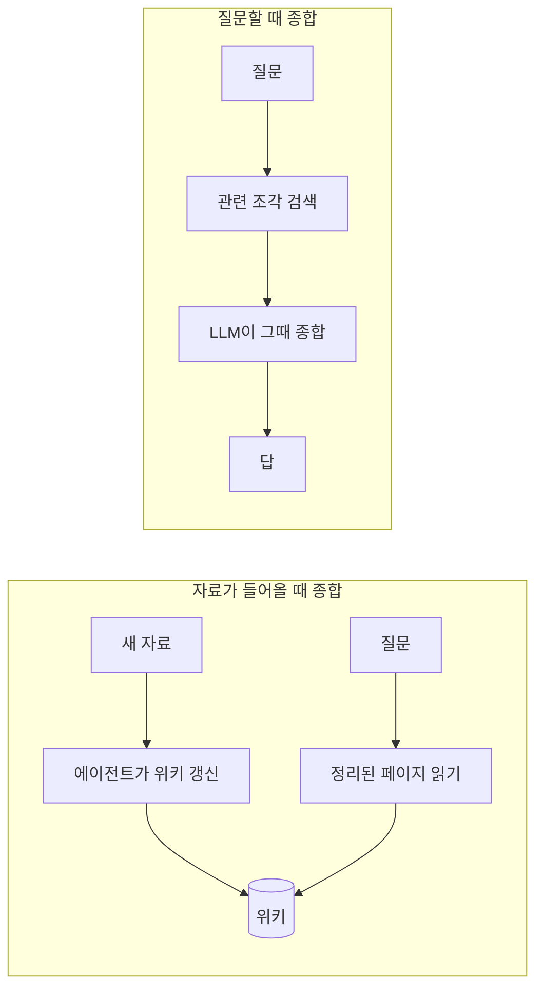
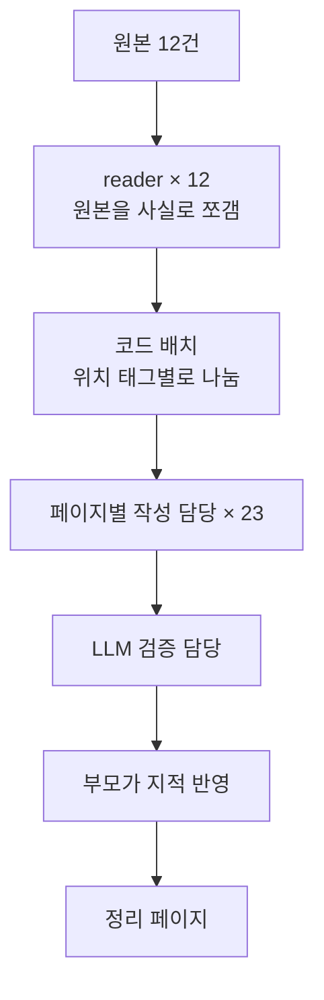
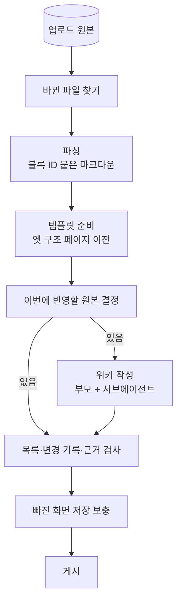
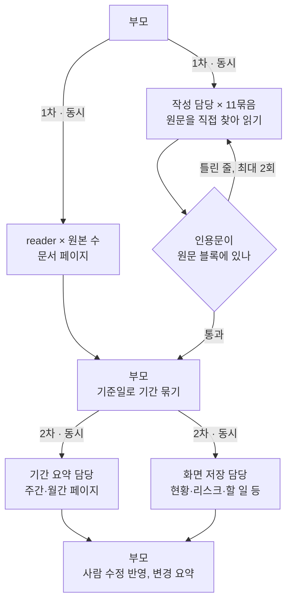
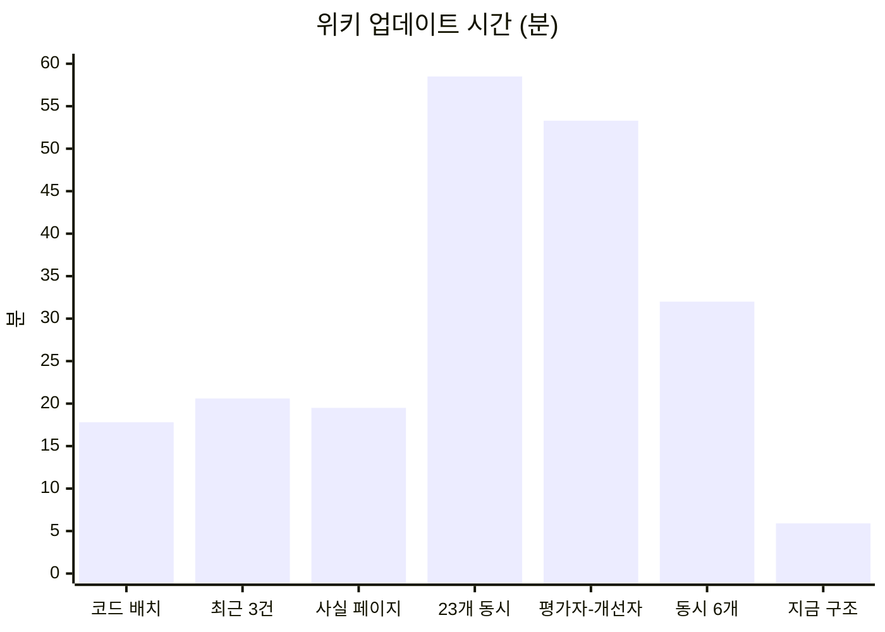

회사에서 프로젝트 수행 자료를 다루는 기능을 만들고 있다. 프로젝트가 진행되는 동안 주간보고, 월간 메일, PMO 점검 보고 같은 자료가 계속 올라오고, PMO는 이걸로 "이 프로젝트가 지금 어떤 상태인지", "어떤 리스크가 커지고 있는지"를 파악해야 한다.

이 글은 그 자료를 RAG로 찾는 대신 위키로 정리해 두기로 한 이유와, 위키를 쓰는 에이전트를 만들면서 겪은 시행착오, 그리고 지금의 구조를 정리한 것이다.

## 왜 위키인가

### 언제 종합하느냐의 차이

위키도 결국 읽고 찾는 대상이다. RAG와 갈리는 지점은 자료를 **언제 종합하느냐**다.



RAG는 질문이 들어올 때마다 관련 조각을 찾아 그 자리에서 답을 만든다. 질문 하나에 답하기에는 좋지만, 우리가 필요한 건 "지난주 대비 진척이 얼마나 밀렸는지", "같은 이슈가 몇 주째 반복되는지", "보고서와 점검 결과의 수치가 왜 다른지" 같은 것이었다. 이런 답은 여러 주의 자료를 겹쳐 봐야 나오는데, 질문할 때마다 조각을 모아 다시 맞추면 매번 결과가 조금씩 달라지고 빠지는 조각도 생긴다.

위키는 자료가 들어올 때 한 번 종합해 두고, 다음 자료가 오면 그 페이지를 고친다. 진척 페이지에는 기준일별 추이가 쌓이고, 리스크 페이지에는 사례가 쌓인다. 질문할 때는 이미 정리된 페이지를 읽으면 된다.

### 다른 선택지와 비교

| 방식 | 잘하는 것 | 우리 경우에 걸린 것 |
| -- | -- | -- |
| 벡터 검색(RAG) | 특정 내용을 빨리 찾아 답하기 | 추이, 상충, "현재 상황" 같은 누적 판단이 남지 않음 |
| GraphRAG | 엔티티 사이 관계를 따라가기 | 엔티티·관계 틀을 미리 설계해야 하고, 결과를 사람이 읽고 고치기 어려움 |
| RDB 조회(text-to-SQL) | 화면에 이미 있는 정형 데이터 | 주간보고·메일 본문 같은 비정형 내용은 담지 못함 |
| 위키 | 누적된 정리를 사람이 읽고 고치기 | 쓰는 비용이 자료가 들어올 때 한꺼번에 든다 |

위키를 고른 이유는 세 가지였다.

- **사람이 읽고 고칠 수 있다.** PMO가 페이지를 열어 보고, 틀린 줄은 직접 고친다. 다음 갱신 때 에이전트는 사람이 고친 내용을 지우지 않는다.
- **근거를 따라갈 수 있다.** 모든 문장 끝에 원문 블록을 가리키는 근거가 붙어서, 클릭하면 원문 위치로 간다.
- **다음 작업의 입력이 된다.** 리스크 등록, PM·PMO 할 일 목록, 현황 화면이 모두 위키를 읽고 만들어진다.

화면에 있는 정형 데이터는 지금도 SQL로 조회한다. 다만 그 결과를 근거로 쓰지는 않고, 위키를 쓸 때 참고만 한다.

근거 표기는 이런 모양이다. 원문은 파싱할 때 블록 단위로 ID가 붙고, 근거는 블록 ID와 인용문으로 적는다.

```text
- N월 3주 기준 전체 WBS 실적 58.40%, 계획 61.20%, 달성률 95.42% [근거: /parsed/.../N주차 점검 보고.md#blk-0003 "WBS 기준 58.40%"]
```

(예시의 날짜와 수치는 실제 프로젝트 값이 아니다.)

위키에는 두 종류의 페이지가 있다. 원본마다 내용을 빠짐없이 옮긴 **문서 페이지**와, 여러 원본을 주제별로 종합한 **정리 페이지**(진척, 인력, 원가, 요구사항, 리스크 등)다. 이 글에서 "위키가 얇다"고 할 때는 정리 페이지 이야기다.

## 처음 구조와 문제

에이전트는 [deepagents](https://docs.langchain.com/oss/python/deepagents/overview)로 만들었다. 부모 에이전트가 서브에이전트에게 일을 맡기고, 가상 파일시스템으로 위키 파일을 읽고 쓰는 구조다.



reader는 원본 하나를 읽어 사실 목록으로 옮기는 서브에이전트다. 위 그림은 실험을 몇 번 거친 뒤의 모습이고, 맨 처음에는 reader가 뽑은 사실을 부모 한 명이 정리 페이지에 옮겨 적었다.

문제는 정리 페이지가 얇다는 것이었다. 원본 12건에서 reader가 뽑은 사실 중 정리 페이지에 들어간 게 11% 남짓이었다. 같은 원본 12건(pptx 5, 메일 4, docx 2, pdf 1)을 고정해 두고 실험을 스무 번 가까이 다시 돌렸다.

## 시행착오

### 빠짐없이 뽑았더니 목록이 됐다

처음엔 reader가 원인으로 보였다. 큰 주간보고 하나가 10만 자쯤 되는데 reader는 원본당 사실을 20-30개만 뽑고 있었다. 그래서 원문을 블록 경계에서 1.6만 자씩 잘라 동시에 읽히고, 블록마다 "옮김 / 넘김 / 못 봄"을 기록했다. 사실은 302개에서 3,883개로 늘었다.

그런데 이번엔 부모가 그 사실을 다 옮기지 못했다. 사실을 페이지에 놓는 일은 대부분 "이건 진척의 마일스톤 절" 같은 분류라서, reader가 사실마다 위치 태그(`{진척/마일스톤}`)를 붙이고 코드가 그 절에 넣게 했다. 반영률(뽑은 사실 중 정리 페이지에 들어간 비율)은 11%에서 83%가 됐다.

숫자는 좋아졌는데 페이지를 열어 보니 원본 12건만으로 정리 페이지에 4,273줄이 쌓여 있었다. 리스크 재료가 되는 사실은 주제 절과 리스크 절에 한 번씩 들어가서 사실 수보다 줄이 많았다. 정리가 아니라 원본을 다시 쏟아 놓은 목록이었다. 반영률은 사실이 페이지에 "있는지"만 셌지 "정리됐는지"는 세지 않았다.

그 뒤로는 지표를 바꿨다.

- **근거 줄**: 정리 페이지에서 근거가 붙은 줄 수
- **인용 블록**: 그 근거들이 가리키는 서로 다른 원문 블록 수
- **빠진 사실**: 뽑은 사실 중 어느 정리 페이지에도 없는 것

그리고 전체 진척률 같은 핵심 수치가 "현재 상황"에 실제로 들어갔는지 매번 눈으로 확인했다.

### 사실 페이지를 따로 만들었다가 지웠다

4,273줄을 줄이려고 절마다 최근 원본 3건의 사실만 남기는 상한을 넣었다. 그러자 "몇 건을 남길지 왜 코드가 정하나", "그 전부터의 추이는 어떻게 보나"라는 질문이 나왔다. 둘 다 맞는 말이었다.

다음엔 사실 전부를 주제별 사실 페이지(`facts/progress.md`)로 빼 봤다. 정보는 남았지만 이것도 reader 결과의 사본이었다. 근거는 원래 "위키 문장 → 원문 블록"으로 이어지고, 원문 전체는 문서 페이지에 이미 있다. 중간에 낀 사본은 아무것도 보태지 않으면서 페이지만 늘렸다. 결국 지웠다.

### 부모 한 명이 40쪽을 쓰고 있었다

사실을 어떻게 배치해도 부모가 쓴 근거 줄은 103-165줄에서 맴돌았다. 부모 한 명이 모델 호출 약 100번으로 40여 쪽을 쓰고 있었다. 지시문에 "현재 상황을 갱신하라"고 적어도 달라지지 않았다.

페이지마다 작성 담당(topic-writer)을 두고 동시에 돌리자 근거 줄이 201, 276까지 올라갔다. [deepagents 문서](https://docs.langchain.com/oss/python/deepagents/subagents)가 권하는 대로, 부모는 지휘만 하고 맥락이 큰 일은 서브에이전트에게 나눠 준 것이다.

반대 방향도 해 봤다. 부모가 쓰고 페이지마다 검토 담당이 피드백만 주는 평가자-개선자 구조였다. 검토 23건은 동시에 금방 끝났지만, 부모가 피드백을 한 페이지씩 반영하느라 그 단계만 37분이 걸렸다. 전체 53분에 근거 줄은 148로 오히려 줄었다. 막힌 곳은 검토가 아니라 부모가 하나씩 처리하는 부분이었다.

### 23개를 동시에 띄우자 58분이 걸렸다

페이지별 담당 23개를 한꺼번에 띄운 실험은 58분이 걸렸다. 로그를 보니 담당들이 시작하자마자 LLM 요청이 분당 1-10건으로 떨어졌다. 호출마다 입력이 4만-18만 토큰씩 몰리자 Azure OpenAI가 429도 없이 응답을 멈췄고, 클라이언트는 180초 timeout을 꼬박 기다린 뒤 다시 보내고 있었다. 출력은 몇백 토큰인데 190-217초씩 걸린 호출이 20건이었다.

429가 오면 잠깐 쉬었다 다시 부르면 된다. 응답이 그냥 멈추면 timeout까지 기다리는 시간이 그대로 전체 시간이 된다. 동시 호출을 6개로 묶고 담당 입력을 절반으로 줄이자 24분까지 내려왔다. 같은 설정에 사실 사본 제거를 더한 다음 실험은 32분이었는데, 같은 구조도 모델 배포 상태에 따라 5-10분씩 흔들렸다. 병렬로 얼마나 빨라질지는 코드보다 모델 배포의 처리량이 정했다.

### 단일 에이전트에게 같은 일을 시켜 봤다

여기까지 와도 run은 20-30분이었다. 그래서 같은 원본을 서브에이전트 없는 Claude 하나에게 주고 진척, 인력, Activity 세 페이지를 쓰게 했다. Activity는 리스크를 점검 활동별로 모은 페이지다. 6분이 걸렸다.

| 페이지 | 위키(동시 6개 실험) 근거 줄 / 인용 블록 | 단일 에이전트 근거 줄 / 인용 블록 |
| -- | -- | -- |
| 진척 | 34 / 16 | 52 / 46 |
| 인력 | 30 / 11 | 35 / 23 |
| Activity(진척/품질) | 4 / 15 | 5 / 24 |

Activity는 한 줄에 근거를 여러 개 단 경우라 인용 블록이 근거 줄보다 많다.

이 비교에는 모델 차이도 섞여 있다. 위키는 Azure OpenAI 모델, 단일 에이전트는 Claude였다. 그래서 구조만의 효과라기보다 "이렇게 단순하게 해도 이만큼 나온다"는 기준선으로 봤다.

더 아팠던 건 내용이었다. 단일 에이전트의 진척 페이지는 첫 줄이 전체 WBS(작업 분해 구조) 진척률이었는데, 위키의 "현재 상황"에는 그 수치가 아예 없었다. 여러 행이 같은 인용문 `"1,234"`(실제 값은 다르다) 하나를 근거로 달고 있기도 했다. 숫자 하나짜리 인용문도 원문에 있기만 하면 근거 검사를 통과했다.

단일 에이전트가 한 일은 단순했다.

1. 짧은 메일과 점검 보고는 통째로 읽고, 큰 주간보고는 진척 표·인력 표·이슈 행만 grep으로 찾았다.
2. 읽은 내용을 한 맥락에 둔 채 바로 페이지를 썼다.
3. 인용문이 실제 블록에 있는지만 스크립트로 확인했다.

위키 쪽은 원문을 사실 3,883개로 쪼개고, 코드가 나누고, 담당이 다시 합치고, 검증 담당이 보고, 부모가 고쳤다. 손이 바뀔 때마다 핵심이 조금씩 빠졌고, 중간 결과를 썼다가 다시 읽는 시간이 쌓였다.

## 결과적으로 이렇게 구성했다

단일 에이전트처럼 일하되, 자료가 많아도 버틸 수 있게 나눴다.

### run 전체 흐름

바깥은 순서가 정해진 LangGraph 노드다. 판단이 필요한 일은 가운데 에이전트 단계만 맡는다.



### 에이전트 단계 안쪽

부모는 코드 실행 도구(`eval`)를 두 번 호출해 담당들을 동시에 띄운다.



### 담당별로 하는 일

| 담당 | 읽는 것 | 하는 일 | 결과물 |
| -- | -- | -- | -- |
| 부모 | 기존 페이지 목록, 이번에 반영할 원본 목록, 사람이 고친 항목 | 담당을 띄우고, 사람 수정만 직접 반영 | 바꾼 페이지별 한 줄 요약 |
| reader (원본마다) | 그 원본 하나 | 블록 하나도 빼지 않고 사실로 옮김 | 원본별 문서 페이지, 보고 기준일 |
| 작성 담당 (11묶음) | 맡은 페이지, 이번 원본(grep·read로 필요한 곳만) | 지난 내용은 두고 이번 원본으로 현재 상황·추이·사례를 고침 | 정리 페이지 1-4쪽 |
| 기간 요약 담당 | 기간별로 묶인 원본 | 기간마다 들어온 정보를 정리 | 주간·월간 페이지 |
| 화면 저장 담당 | 위키 페이지와 그 근거 원문 | 위키 내용을 앱 화면 형식으로 옮김 | 현황, 리스크, 할 일, 단계 점검 |
| 코드 | 파싱 결과, 위키 파일 | 파싱, 반영할 원본 결정, 인용문 검사, 목록 페이지, 게시 | 블록 ID가 붙은 원문, 목록·기록 페이지 |

작성 담당 11묶음은 사업 개요, 진척·일정, 인력, 원가·규모, 요구사항·평가·문제 관리, 리스크(4개 묶음), 기타 주제, 주간·월간 요약이다.

몇 가지를 덧붙이면 이렇다.

- 원문을 맥락에 통째로 싣지 않는다. 작성 담당이 grep으로 필요한 표와 행을 찾아 읽기 때문에 원본이 수백 건이어도 같은 방식이 통한다.
- 인용문 검사는 코드가 한다. 담당이 끝내려 할 때 검사해서 고칠 수 있는 건 고치고, 나머지 줄은 두 번까지 돌려준다. LLM 검증 담당은 뺐다.
- 어느 묶음에도 안 맞는 내용은 기타 주제 담당이 `topics/` 아래 새 페이지로 쓴다. 실험에서는 데이터 이행, 시스템 연계 페이지가 새로 생겼다.
- 흩어져 있던 사업 기본정보와 누적 현황은 `overview.md` 한 페이지로 합쳤다. 위키의 첫 화면이다.
- 묶음 크기도 중요했다. 처음엔 리스크 담당 하나에 Activity 16쪽을 맡겼더니 Activity마다 리스크 사례가 1행씩만 들어갔다. 담당 하나가 1-4쪽을 맡게 나누자 나아졌다.

처음 구조와 비교하면 원문이 정리 페이지에 닿기까지 거치는 손이 넷에서 하나로 줄었다.

### 결과



| 실험 | 바꾼 것 | 시간 | 근거 줄 | 인용 블록 | 빠진 사실 |
| -- | -- | -- | -- | -- | -- |
| 출발점 | reader가 원본당 사실 20-30개 | - | - | - | 반영률 11% |
| 빠짐없이 뽑기 | 원문을 잘라 사실 3,883개로 | 38분 | - | - | - |
| 코드 배치 | 위치 태그로 코드가 절에 배치 | 17분 46초 | 165 | 33 | 90 |
| 최근 3건 | 절마다 최근 원본 3건만 | 20분 33초 | 151 | 41 | 101 |
| 사실 페이지 | 사실을 별도 페이지로, 부모가 정리 | 19분 32초 | 103 | 39 | 95 |
| 23개 동시 | 페이지마다 작성 담당 | 58분 32초 | 201 | 90 | 55 |
| 평가자-개선자 | 부모가 쓰고 검토 담당이 피드백 | 53분 20초 | 148 | 45 | 125 |
| 동시 6개 | 동시 호출 제한, 사실 사본 제거 | 31분 58초 | 276 | 104 | 26 |
| 지금 구조 | 묶음 담당이 원문을 직접 읽고 씀 | **5분 56초** | 270 | 71 | 26 |

시간은 파싱을 뺀 위키 업데이트 시간을 한 번씩 잰 값이다. 직전 구조(동시 6개)와 비교하면 근거 줄은 비슷하고 인용 블록은 적지만 시간은 5분의 1이다. 그리고 진척 페이지 "현재 상황" 첫 줄에 전체 진척률이 들어갔다. 구조를 바꾼 이유는 이 숫자들보다 그 한 줄이었다.

## 배운 것

- 구조에 단계를 더하기 전에, 같은 입력을 단일 에이전트에게 먼저 맡겨 본다. 그보다 느리고 얇다면 단계를 더할 게 아니라 덜어야 한다.
- 지표 하나가 좋아지면 페이지를 직접 연다. 반영률 83%짜리 위키는 4,273줄짜리 목록이었다.
- 인용문이 원문에 있는지 같은 확인은 코드에 맡기고, 무엇이 지금 유효한지 같은 판단은 원문을 본 LLM에게 둔다.
- 공급자가 429 없이 멈출 수 있다고 보고 timeout을 정하고, 동시 호출 수와 호출당 입력 크기를 함께 묶는다.
- 같은 코드도 run마다 5-10분씩 흔들린다. 구조를 판단할 시간은 두 번 이상 잰다. 이 글의 표도 한 번씩 잰 값이라 작은 차이는 의미가 없다.

아직 남은 것도 있다. 인력과 Activity 페이지는 여전히 단일 에이전트 결과보다 얇다. 숫자 하나짜리 인용문도 근거 검사를 통과하는 구멍은 아직 막지 못했다. 원본 수백 건이 여러 run에 나뉘어 들어올 때의 시간과 품질도 더 재 봐야 한다.
